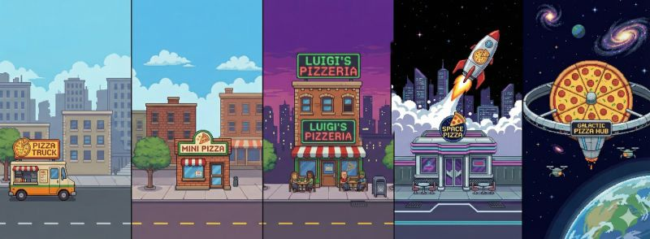

# PizzaMaximizer



[start game](https://htmlpreview.github.io/?https://github.com/strangeoptics/pizzamaximizer/blob/main/pizza.html)

Kurz: Ein kleines Browser-Spiel/Prototyp, in dem du Pizzen herstellst, Kunden bedienst, Zutaten per Arbeiter besorgst, Autos kaufst und dein Geschäft ausbaust.

**Zweck**
- Prototyp zum Ausprobieren einfacher Spielmechaniken (Tick-Loop, Ressourcen, Shops, Upgrades).

**Hauptfunktionen**
- Manuelles Erstellen von Pizzen (`Make Pizza`-Button).
- Kunden-Warteschlange (FIFO). Kunden verlassen nach 10 Ticks, falls nicht bedient — Reputation sinkt.
- Zutaten-Inventar: jede Pizza verbraucht 4 Einheiten.
- Arbeiter (`Send Worker`) holt Zutaten; Fahrtkosten schwanken, Fahrtzeit und Menge hängen vom Auto ab.
- Autos: verschiedene Fahrzeuge mit Größe/Speed/Preis; Auto-Kauf verbessert Arbeiterfahrten.
- Business-Upgrades (Food Truck → Einraumpizzeria → Pizzeria → Super Store) erhöhen Bedienkapazität und Preis-Multiplikator.
- Developer-Panel zum schnellen Setzen von Geld, Reputation, Ticks etc. Export/Import des Spielzustands als JSON.

**Dateien**
- `pizza.html` — UI + Event-Handler. Öffne diese Datei im Browser.
- `pizza.js` — Spiel-Logik (Klasse `PizzaGame`, Tick-Schleife, State, Methoden wie `makePizza`, `sendWorker`, `buyCar`, `buyBusiness`).

**Wie man das Spiel startet**
- Einfach: Datei `pizza.html` im Browser öffnen (Doppelklick oder Drag & Drop).
- Besser (lokaler Server, CORS sicher): im Projekt-Ordner ein kleines HTTP-Server starten und die Seite aufrufen. Beispiel (PowerShell / Windows):

```powershell
# Im Projektordner ausführen
python -m http.server 8000
# Öffne dann http://localhost:8000/pizza.html im Browser
```

**Steuerung / UI**
- `Start` / `Stop` / `Step` / `Reset` — Tick-Schleife steuern.
- `Make Pizza` — erstellt eine Pizza (benötigt 4 Zutaten).
- `Send Worker` — Arbeiter schicken (zahlt sofort den aktuellen Zutatenpreis, Arbeiter kommt nach einigen Ticks zurück).
- `Buy Car` / `Upgrade Business` — Shop-Buttons erscheinen, wenn Items freigeschaltet sind.
- Developer-Panel: rohes JSON, `Price per Pizza`, `Set Money`, `Set Reputation`, `Fast-forward`.

**Export / Import**
- Im Developer-Panel kannst du den aktuellen Zustand als JSON exportieren und wieder importieren. Das JSON enthält u. a. `tick`, `pizzas`, `customers` (Anzahl), `ingredients`, `ingredientPrice`, `worker`-Status, `money`, `reputation`, `price`, `currentCarId`, `currentBusinessId`.

**Entwickeln / Anpassen**
- Änderungen am Spiel: `pizza.js` ändern und die Seite im Browser neu laden.
- UI-Änderungen: `pizza.html` anpassen.
- Tipp: Verwende die Developer-Konsole des Browsers (F12) zum Debuggen; ein globales `window._pizzaGame` liegt beim Laden bereit.

**Bekannte Punkte / ToDos**
- Balancing (Preise, Unlock-Ticks, Reputation-Effekte) ist noch experimentell.
- UX-Politur (Animationen, Persistenz, besserer Shop) fehlt.

**Mitwirken**
- Forke das Repo, erstelle einen Branch, und öffne einen Pull Request mit einer Beschreibung deiner Änderungen.

**Lizenz**
- Keine Lizenz im Repo hinterlegt. Füge bei Bedarf eine `LICENSE`-Datei hinzu (z. B. MIT), wenn du das Projekt freigeben möchtest.

---
Wenn du möchtest, schreibe ich noch eine englische Version oder füge eine kurze Spielanleitung mit Screenshots hinzu.
